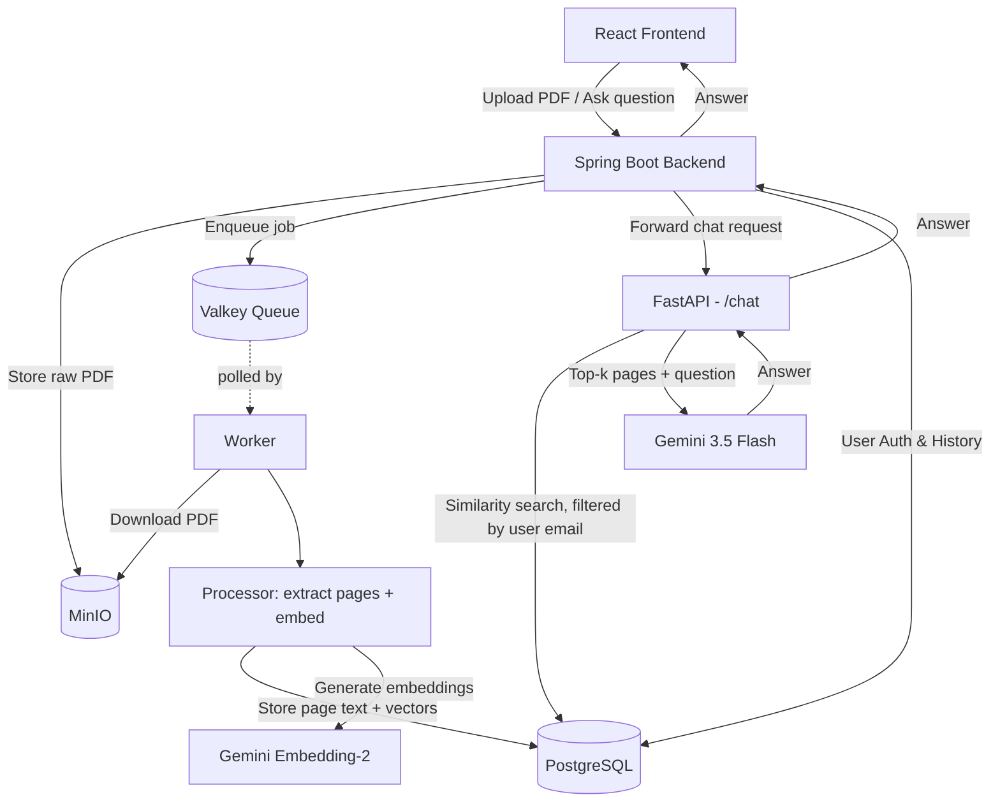

# 🎓 AI Study Assistant


> Upload your study material as PDFs and chat with it using Retrieval-Augmented Generation (RAG), powered by Google Gemini.

## Background

This project serves as the technical implementation for the comprehensive research report, *Design and Implementation of a Context-Aware AI Study Assistant utilizing Retrieval-Augmented Generation (RAG)*, developed for the S. N. Bose Scholars Program.

## Overview

AI Study Assistant lets a user upload PDF documents, ask natural-language questions about them, and browse their upload history[cite: 1]. Uploaded PDFs are processed using page-level text extraction, embedded, and stored in a vector database so chat answers are grounded in the user's own documents instead of the model's general knowledge[cite: 1].

The system is split into three independently deployable layers[cite: 1]:

| Layer | Folder | Responsibility | Docs |
|---|---|---|---|
| **Frontend** | [`react-frontend/`](./react-frontend) | Upload / Chat / History UI | [README](./react-frontend/README.md) |
| **Backend** | [`Backend/Ai-Study-Assistant-Backend/`](./Backend/Ai-Study-Assistant-Backend) | Auth, request routing, MinIO uploads, job queueing | [README](./Backend/Ai-Study-Assistant-Backend/README.md) |
| **AI Service** | [`Ai-python-service/`](./Ai-python-service) | PDF processing, embeddings, similarity search, LLM answers | [README](./Ai-python-service/README.md) |

## Features

- 📄 **Upload** — upload PDF study material from the React UI[cite: 1].
- 💬 **Chat** — ask questions about your uploaded documents and get grounded, context-aware answers[cite: 1].
- 🕘 **History** — view previously uploaded documents[cite: 1].
- 🔐 **Per-user isolation** — pages are tagged with the uploader's email, so a user's questions only ever retrieve context from their own documents[cite: 1].
- ⚙️ **Asynchronous ingestion** — page-level text extraction and embedding happen off the request path via a background worker and a Valkey queue, so uploads return quickly[cite: 1].

## Architecture



**Upload:** frontend → backend (auth via PostgreSQL) → MinIO (raw file) + Valkey (job) → worker polls → downloads PDF → extracts pages + embeds → stores in pgvector.

**Chat:** frontend → backend (auth) → FastAPI → similarity search in pgvector (filtered by user email) → Gemini 3.5 Flash with top-k pages as context → answer relayed back.

**History:** frontend → backend → list of the user's previously uploaded documents[cite: 1].

## Tech Stack

| Layer | Stack |
|---|---|
| Frontend | React, Vite[cite: 1] |
| Backend | Java, Spring Boot, Maven, MinIO client, Valkey client, PostgreSQL |
| AI Service | Python, FastAPI, pgvector, Gemini 3.5 Flash, Gemini Embedding-2[cite: 1] |
| Infra | MinIO, Valkey, PostgreSQL + pgvector, Docker Compose[cite: 1] |

## Project Structure

```text
AI-Study-Assistant/
├── Ai-python-service/                # AI / RAG service — see its README
├── Backend/
│   └── Ai-Study-Assistant-Backend/   # Spring Boot backend — see its README
├── react-frontend/                   # React frontend — see its README
├── docker-compose.yml                # Orchestrates the full stack
├── package.json
└── .gitignore
```

## Quick Start

Requires Docker & Docker Compose, plus a Google Gemini API key[cite: 1].

1. **Clone the repository:**
   ```bash
   git clone <https://github.com/BikiBaishya03/Ai-Study-Assistant>
   cd AI-Study-Assistant
   ```

2. **Configure Environment Variables:**
   Before running the containers, you must configure the environment variables and secrets for each service. See the individual READMEs for detailed placeholder variables:
   - **Python Service:** Create `Ai-python-service/.env`
   - **Spring Boot Backend:** Update `Backend/Ai-Study-Assistant-Backend/src/main/resources/application.properties`
   - **React Frontend:** Create `react-frontend/.env`

3. **Start the application:**
   ```bash
   docker-compose up --build
   ```

| Service | Default URL |
|---|---|
| React frontend | http://localhost:5173[cite: 1] |
| Spring Boot backend | http://localhost:8080[cite: 1] |
| Python FastAPI (internal) | http://localhost:8000[cite: 1] |
| MinIO console | http://localhost:9001[cite: 1] |

For per-service environment variables, local dev setup (without Docker), and API references, see each service's README linked in the table above[cite: 1].

## Multi-tenant Data Isolation

Every page stored in pgvector is tagged with the uploading user's email. At query time, the FastAPI chat endpoint filters the similarity search by that same email, so a user's questions can only retrieve context from documents they uploaded.

## Roadmap Ideas

- Streaming chat responses[cite: 1]
- Support for additional file types (docx, pptx, OCR for scanned PDFs)[cite: 1]
- Per-document chat scoping (ask about one document instead of all)[cite: 1]
- Upload progress / processing status shown in the History tab[cite: 1]

## Contributing

1. Fork the repo[cite: 1]
2. Create a feature branch: `git checkout -b feature/your-feature`[cite: 1]
3. Commit your changes[cite: 1]
4. Open a pull request[cite: 1]
